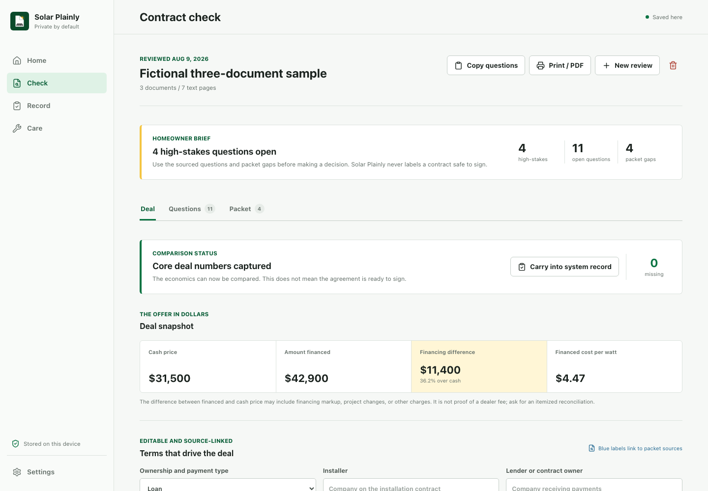

# Solar Plainly

Solar Plainly is an open-source, private-by-default solar deal review and system record for homeowners.



It helps a homeowner:

- assemble up to eight searchable contract, financing, disclosure, warranty, and interconnection documents into one review;
- compare cash price, amount financed, cost per watt, payment changes, and scheduled outlay with visible arithmetic;
- keep every extracted term and question linked to its source document, page, and excerpt;
- identify missing deal numbers and unconfirmed packet items before comparing an offer;
- print a concise homeowner brief or copy the open questions for the seller and lender;
- keep equipment, warranty, utility, installer, and handoff details together;
- carry reviewed system terms into the ownership record instead of retyping them;
- import monitoring CSV data and track maintenance, production, service issues, and warranty claims;
- export or erase the complete local record without creating an account.

The app does not grade a contract or declare it safe. It exposes the numbers, assumptions, obligations, sources, and missing documents that a homeowner needs to resolve with qualified people.

## Why this exists

Solar proposals mix construction, lending, tax assumptions, utility approvals, equipment warranties, and long-term home obligations. The [CFPB has documented hidden solar-loan markups and confusing payment structures](https://www.consumerfinance.gov/data-research/research-reports/issue-spotlight-solar-financing/), while the [FTC advises consumers to slow down and inspect warranties, cancellation terms, payment schedules, and hidden fees](https://consumer.ftc.gov/consumer-alerts/2024/09/solar-energy-rising-popularity-so-are-scams).

After installation, the paperwork and operating history often fragment across an installer, lender, utility, manufacturer, monitoring portal, and homeowner inbox. Solar Plainly keeps the homeowner's copy coherent without becoming another lead seller or cloud account.

## Privacy model

- No login or server database.
- PDF text extraction runs in the browser.
- Contract checks use visible deterministic rules, not an undisclosed model or score.
- Records and saved files live in browser IndexedDB.
- Backups are portable JSON files controlled by the user.
- No analytics, advertising, lead sale, or cloud document endpoint.

Browser storage is not a backup. Export after important changes.

## Run locally

Requirements: Node.js 22 or newer and npm.

```bash
npm install
npm run dev
```

Open `http://localhost:5173`.

## Checks

```bash
npm run check
npm run test:e2e
```

The end-to-end suite uses Playwright Chromium:

```bash
npx playwright install chromium
```

## Project shape

```text
src/components/          Product screens and shared interface pieces
src/lib/contractAnalyzer.ts  Deterministic review rules and source extraction
src/lib/deal.ts          Deal-term mapping and inspectable financial arithmetic
src/lib/pdf.ts           In-browser PDF text extraction
src/lib/storage.ts       IndexedDB persistence
src/lib/backup.ts        Validated export/import and local document storage
src/lib/production.ts    Production comparisons and recurring dates
src/lib/productionImport.ts  Structured monitoring CSV import
docs/                    Product, research, architecture, and QA records
tests/e2e/               Desktop and mobile browser journeys
```

## Important limitations

- Searchable PDFs only. Scans need OCR before import.
- The rule engine can miss terms, attachments, unusual wording, or document context.
- Extracted values are editable because document formats vary; blue source labels link fields back to packet pages.
- Loan calculations are mathematical comparisons based on entered terms, not a lender payoff statement or an affordability recommendation.
- A missing topic means "not located," not "absent."
- Monitoring CSV formats vary. The importer recognizes common date/month and energy columns but does not connect directly to inverter vendors.
- Production comparisons are not weather-normalized engineering analysis or equipment diagnosis.
- This is educational software, not legal, tax, financial, engineering, or warranty advice.
- Tax and consumer-protection rules change. The app links to current primary sources rather than treating old percentages or deadlines as permanent.

Read [the product brief](docs/PRODUCT_BRIEF.md), [research record](docs/RESEARCH.md),
[evidence and validation sourcing plan](docs/SOURCING_PLAN.md),
[architecture](docs/ARCHITECTURE.md), and [security policy](SECURITY.md).

## Contributing

Issues and pull requests are welcome. Review [CONTRIBUTING.md](CONTRIBUTING.md) before changing contract rules or data behavior.

Solar Plainly is available under the [MIT License](LICENSE).
